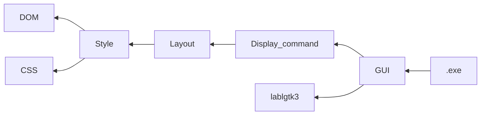

# Minibrowser

Minibrowser is a toy web browser written in the OCaml.

## Usage

```bash
# Install dependencies
opam switch create . --deps-only --with-test

# Run tests
dune runtest

# Run minibrowser
dune exec minibrowser
```

## Modules for rendering

- `Dom`
  - This module parses HTML and creates a DOM tree based on the elements and
    their relationships.
- `Css`
  - This module parses CSS files and generates style rules that are applied to
    each element.
- `Style`
  - This module combines the results of `Dom` and `Css` to create a tree
    structure data structure that associates the CSS rules applied to each
    element.
- `Layout`
  - This module calculates the positions and sizes of elements based on the
    results of `Style`, and generates a tree structure data structure that
    associates this information.
- `Display_command`
  - This module creates data that consolidates information about element shapes,
    sizes, background colors, etc., based on the results of `Layout`, and
    outputs them as a linear list. The `Gui` module will draw the command list
    generated by `Display_command` in order.
- `Gui`
  - This module uses [garrigue/lablgtk](https://github.com/garrigue/lablgtk) to
    perform drawing on the display. It receives drawing commands from
    `Display_command` and displays elements on the screen.



## TODO

- Implement a more complete HTML and CSS parser to support a wider range of web
  content.
- Add JavaScript support to enable interactive web pages and improve the overall
  browsing experience.
- Enhance network functionality for better resource loading and handling
  HTTP/HTTPS requests.
- Improve error handling and reporting to provide better feedback to users and
  developers.
- Optimize the rendering engine for better performance on complex web pages.
- Add support for browser features such as bookmarks, history, and tabs.
- Implement web storage and cookies for improved website compatibility and user
  experience.
- Add developer tools such as an element inspector, network monitor, and
  JavaScript console.
- Implement accessibility features to make the browser more inclusive for users
  with disabilities.
- Create a plugin and extension system to allow users to customize and extend
  the functionality of the browser.
- etc...

## References

1. [ちいさな Web ブラウザを作ってみよう](https://browserbook.shift-js.info/)
2. [Let's build a browser engine!](https://limpet.net/mbrubeck/2014/08/08/toy-layout-engine-1.html)
3. [mbrubeck/robinson: A toy web rendering engine](https://github.com/mbrubeck/robinson)
