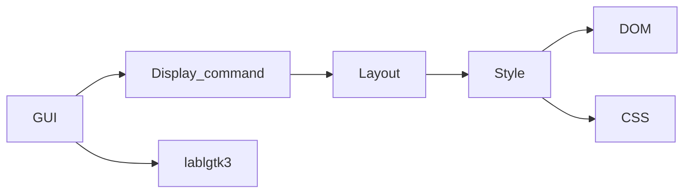

# minibrowser

```bash
opam install --deps-only --with-test .

dune runtest

dune exec minibrowser
```

## Modules for rendering



## References

1. [ちいさな Web ブラウザを作ってみよう](https://browserbook.shift-js.info/)
2. [Let's build a browser engine!](https://limpet.net/mbrubeck/2014/08/08/toy-layout-engine-1.html)
3. [mbrubeck/robinson: A toy web rendering engine](https://github.com/mbrubeck/robinson)
